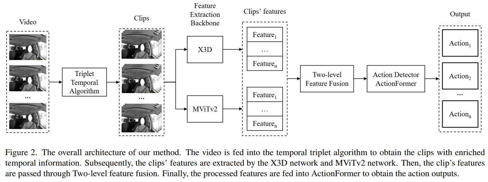

# [CVPRW 2023] AI City Challenge: Triplet Temporal-based Video Recognition with Multiview for Temporal Action Localization
# Introduction
- [Track 3 of AI City Challenge 2023 - Naturalistic Driving Action Recognition](https://www.aicitychallenge.org/2022-challenge-tracks/) solve the problem of naturalistic driving action recognition. Particularly, given a video input from three different views of a driver inside a car (dashboard, rear and right-side window cameras), the objective is to identify different actions from the driver.

- We propose **Triplet Temporal-based Video Recognition with Multiview for Temporal Action Localization** for solve the problem. The method is developed by Viettel Cyberspace Center, Viettel Group.

<p align="center">
 
</p>

# Installation
Please find installation instructions for PySlowFast in [here](https://github.com/facebookresearch/SlowFast/blob/main/INSTALL.md) and ActionFormer in [here](https://github.com/happyharrycn/actionformer_release/blob/main/INSTALL.md).

# Data Preparation
### Step 1: Format the label in file .csv
- Download the training data (SetA1), which is provided by 2023 ACity Challenge and put it into ./data/SetA1
- Then formatting the label in file .csv by running:
```bash
cd /data_processing
python label_df_processing.py
cd ../
```
The output is located in the folder /data/SetA1/processed_label_csv
- **Note**: There are typos in the label dataframe: the mismatch filename in the user_id_61962.csv. Therefore, please change the "User_id_30932_5" and "User_id_30932_7" to "User_id_61962_5" and "User_id_61962_7", respectively. 

### Step 2: Enhance video with Temporal triplet algorithm (2.5D)
```bash
cd /data_processing
python create_25D_video.py --step 9 --worker 40 --src ../data/A1_train --dst ../data/A1_train_2.5D
python create_25D_video.py --step 9 --worker 40 --src ../data/SetA2 --dst ../data/A2_raw_2.5D

cd ../
```
### Step 3: Clip video for action recognition
```bash
cd /data_processing
python cut_video.py --input_dir /path/to/video_input \
                    --output_dir /path/to/clip_output
```

## Data structure
```
data/
    ├── SetA1
    │   ├── proccessd_label_csv
    │   ├── ...
    ├── SetA2
    ├── SetB
    ├── A1_raw_2.5D
    ├── A2_raw_2.5D
    ├── feature_A1
    ├── feature_A2
    ├── train_val_split_3views_more_cls0
    ├── train_val_split_3views_more_cls0_2.5D
```

# Training
## 1. Feature extraction (X3D and MViTv2)
- Please follow steps in [docs/feature_extraction.md](docs/feature_extraction.md)

## 2. Action Localization (ActionFormer)
- Please follow steps in [docs/action_localization.md](docs/action_localization.md)

# Inference
**CHECKPOINT**: The checkpoints of X3D, MVitV2 and ActionFormer from our training process can be found [here]()
### Step 1: Feature extraction
1. Feature extraction:
```bash
# For X3D model:
cd /PySlowFast-X3D
python tools/extract_feature.py --cfg configs/AICity2023/X3D-L_extract_feature.yaml

# For MViTv2 model:
cd /PySlowFast-X3D
python tools/extract_feature.py --cfg configs/AICity2023/MViTv2_extract_feature.yaml
```

**Note**: Please modify the variables in the file config .yaml as follows:
- DATA.PATH_TO_DATA_DIR: path to dataset input, e.g., /data/SetB.
- DATA.PATH_EXTRACT: path to feature output, e.g., /data/featureB.
- WEIGHT: path to checkpoints' model.

2. Concatenate views/models (optional):
```bash
cd /data_processing/concat_view_features.py --feature_dir /path/to/feature \
                                            --output_dir /path/to/feature_output

cd /data_processing/concat_model_features.py --feature_dir_mvit /path/to/feature_mvit \
                                            --feature_dir_x3d /path/to/feature_x3d \
                                            --output_dir /path/to/feature_output
```
### Step 2: Action localization
1. Create data json format
```bash
cd /data_processing
python create_data_json_action_former_without_gt.py --dataset_dir /path/to/SetB \
                                                    --feature_dir /path/to/feature_B \
                                                    --output_dir /path/to/json_format
```

2. Action localization
```bash
cd /action_localization
python ./inference_all.py ./config/AIC_2023_X3D_MViTv2.yaml \
                            /path/to/checkpoint \
                            --num_folds 5 \
                            --output_dir /path/to/raw_prediction
```
**Note**: Please modify the variables in the file config .yaml as follows:
- dataset.json_file: path to data json
- dataset.input_dim: the clip feature dimension

3. Create submission
```bash
cd /data_processing
python convert_to_submission.py --dataset_path /path/to/SetB \
                                --prediction_path /path/to/raw_prediction
```
# Results

# Citation
If you find our work useful, please use the following BibTeX entry for citation.

# Acknowledgement
Codebases: [PySlowFast](https://github.com/facebookresearch/SlowFast) and [ActionFormer](https://github.com/happyharrycn/actionformer_release)


# Contact
Huy Duong Le (duonglh9@viettel.com.vn / huyduong7101@gmail.com)

Manh Tung Tran (tungtm6@viettel.com.vn)

Minh Quan Vu (quanvm4@viettel.com.vn)
